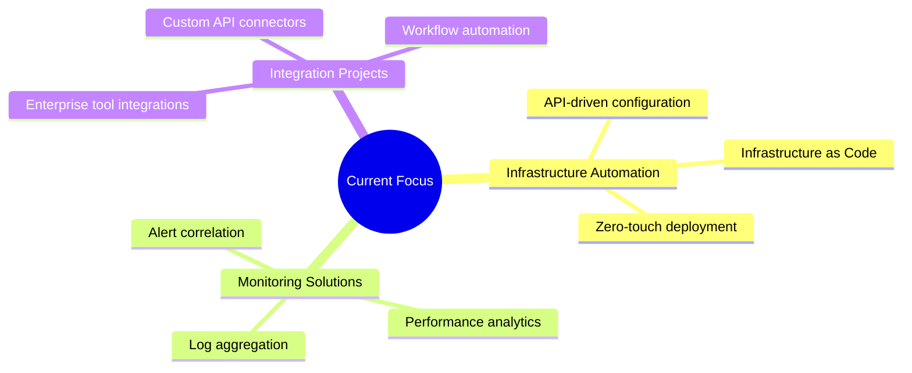

# 
👋 Hello, I'm Dan

  

  
  
  
 

## 🔧 Technologies & Tools

  
  
  
  
  
  
  
  
  

## 📊 GitHub Stats

  
  

## 💼 Private Project Portfolio

*While most of my work is in private repositories, here's an overview of some key projects:*

| Project | Role | Technology Stack | Status |
|---------|------|-----------------|--------|
| **Enterprise Monitoring Platform** | Lead Developer |   |  |
| **Infrastructure Automation Framework** | Architect |   |  |
| **API Integration Hub** | Lead Developer |   |  |
| **System Health Dashboard** | Creator |   |  |

## 🔍 What I'm Working On

## 🌟 Highlighted Skills

<!-- Technical Skills -->
<table>
  <tr>
    <td><strong>Obserability</strong></td>
    <td>
      
      
      
      
    </td>
  </tr>
  <tr>
  <tr>
    <td><strong>Infrastructure Management</strong></td>
    <td>
      
      
      
    </td>
  </tr>
  <tr>
    <td><strong>Automation & Scripting</strong></td>
    <td>
      
      
      
    </td>
  </tr>
  <tr>
    <td><strong>Monitoring & Analysis</strong></td>
    <td>
      
      
      
    </td>
  </tr>
</table>

## 🛠️ Projects by Category

<strong>🔄 Automation Projects</strong>

 
  
- **Enterprise Automation Framework** - Comprehensive system for automating routine infrastructure tasks
- **Configuration Management System** - Dynamic configuration management across heterogeneous environments
- **Deployment Pipeline** - Automated deployment system with rollback capabilities
  

<strong>📊 Monitoring Solutions</strong>

 
  
- **Cross-Platform Monitoring** - Unified monitoring for diverse infrastructure elements
- **Performance Analysis Tools** - Advanced performance metrics collection and analysis
- **Alert Management System** - Intelligent alert processing with correlation capabilities
  

<strong>🔌 Integration Projects</strong>

 
  
- **API Gateway** - Centralized API management and integration hub
- **Data Exchange Platform** - Secure cross-system data synchronization
- **Workflow Automation** - Business process automation across multiple platforms
  

## 📫 Get In Touch

  

---

  

