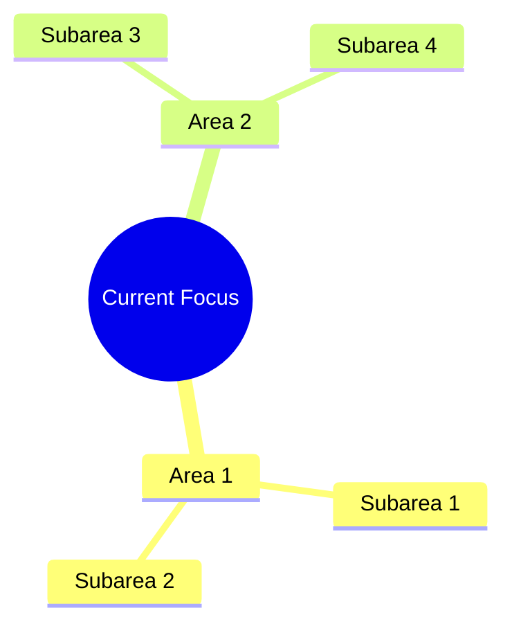

# Private Project Dashboard Guide

This document provides detailed instructions on how to showcase your private projects effectively on your GitHub profile landing page.

## Table of Contents
- [Understanding the Private Project Dashboard](#understanding-the-private-project-dashboard)
- [Updating Project Entries](#updating-project-entries)
- [Badge Reference Guide](#badge-reference-guide)
- [Example Project Entries](#example-project-entries)
- [Best Practices](#best-practices)

## Understanding the Private Project Dashboard

The Private Project Dashboard is designed to highlight your work without exposing sensitive information. It consists of:

1. **Project Table**: A concise overview of key projects
2. **Categorized Projects**: Detailed but non-sensitive descriptions organized by category
3. **Current Focus Mindmap**: A visual representation of your current work areas

## Updating Project Entries

### Project Table

The project table follows this format:

```markdown
| Project | Role | Technology Stack | Status |
|---------|------|-----------------|--------|
| **Project Name** | Your Role |  |  |
```

To update:

1. **Project Name**: Use a generic but descriptive name (e.g., "Enterprise Monitoring Platform" instead of client-specific names)
2. **Role**: Your role in the project (e.g., Lead Developer, Architect, Creator)
3. **Technology Stack**: Add technology badges (see Badge Reference Guide below)
4. **Status**: Add a status badge (Active, Maintained, Completed, etc.)

### Categorized Projects

Update the collapsible sections with your projects grouped by category:

```markdown
<details>
<summary><strong>Category Name</strong></summary>
<br>
  
- **Project Name** - Brief description without sensitive details
- **Another Project** - Brief description without sensitive details
  
</details>
```

### Current Focus Mindmap

The mindmap uses Mermaid syntax:

```markdown

```

Update this to reflect your current focus areas. Be specific about technologies and methodologies, but avoid mentioning client names or confidential project details.

## Badge Reference Guide

### Technology Badges

Format:
```

```

Common examples:
- 
  ```
  
  ```
- 
  ```
  
  ```
- 
  ```
  
  ```

### Status Badges

Format:
```

```

Common examples:
- 
  ```
  
  ```
- 
  ```
  
  ```
- 
  ```
  
  ```

## Example Project Entries

### Example 1: Enterprise Tool

```markdown
| **Monitoring Automation Platform** | Lead Developer |   |  |
```

### Example 2: Integration Project

```markdown
| **Multi-System Integration Hub** | Architect |   |  |
```

## Best Practices

1. **Focus on Your Contributions**: Highlight your role, skills, and technologies rather than specific business details.

2. **Use Generic Project Names**: Replace client-specific names with generic industry terms (e.g., "Healthcare Analytics Platform" instead of "Client X Patient System").

3. **Emphasize Technologies**: Showcase the technologies, tools, and methodologies you used, as these demonstrate your skills.

4. **Update Regularly**: Keep your dashboard current, especially as projects change status.

5. **Be Consistent**: Use the same format for all project entries to create a professional appearance.

6. **Balance Detail and Privacy**: Provide enough information to be interesting without disclosing confidential details.

7. **Focus on Impact**: When describing projects, emphasize the problems solved and impact achieved rather than implementation details.

---

Remember, the goal is to present your professional accomplishments effectively while respecting confidentiality requirements.
