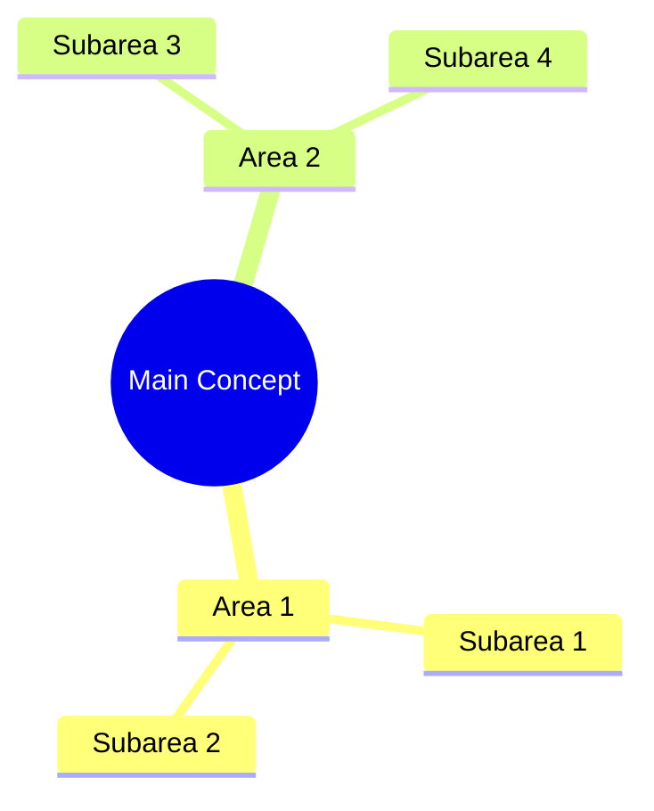
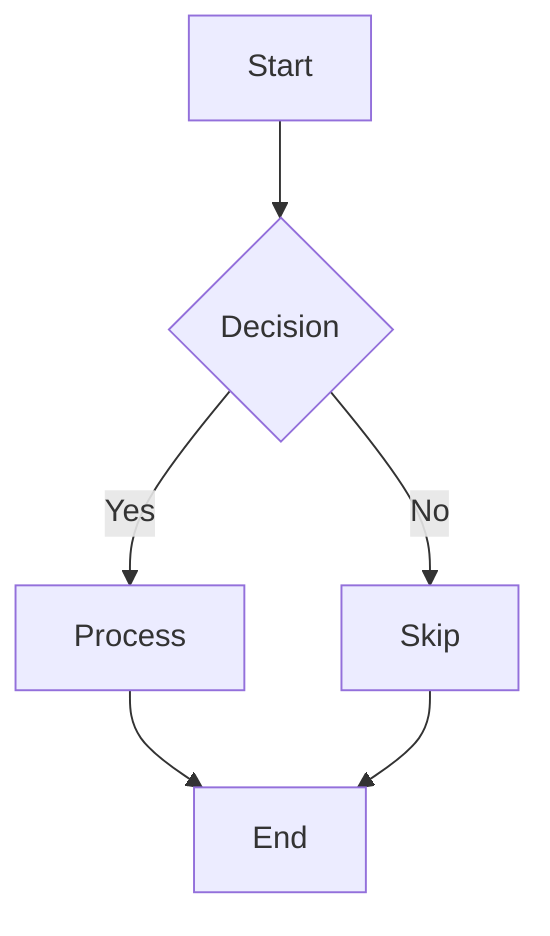

# Custom Graphics & Visual Elements Guide

This document provides guidance on creating and customizing visual elements for your GitHub profile landing page.

## Table of Contents
- [Banner Images](#banner-images)
- [Custom Badges](#custom-badges)
- [Progress Bars](#progress-bars)
- [Mermaid Diagrams](#mermaid-diagrams)
- [Using Custom SVGs](#using-custom-svgs)
- [Recommended Tools](#recommended-tools)

## Banner Images

### Using Capsule Render

Your README uses [Capsule Render](https://github.com/kyechan99/capsule-render) for the header and footer banners. You can customize these by modifying the URL parameters:

```markdown

```

Parameters you can modify:
- `type`: waving, slice, egg, shark, cylinder, soft, transparent, rect
- `color`: Auto, gradient, timeGradient, or specific colors (0a0c10, f7f9fb)
- `height`: Height in pixels
- `text`: The text to display (use %20 for spaces)
- `animation`: fadeIn, blink, twinkling, scaleIn
- `fontColor`: Text color hex code
- `fontSize`: Text size in pixels

Visit the [Capsule Render GitHub page](https://github.com/kyechan99/capsule-render) for more customization options.

## Custom Badges

### Using Shields.io

Shields.io provides customizable badges for various purposes:

```markdown

```

Parameters:
- `Label`: Left side text
- `Message`: Right side text
- `Color`: Background color (e.g., blue, green, red, or hex code like 4c1)
- `style`: plastic, flat, flat-square, for-the-badge, social
- `logo`: Name of a supported logo (see [Simple Icons](https://simpleicons.org/))
- `logoColor`: Color of the logo

### Examples

Technology badge:
```markdown

```

Custom status badge:
```markdown

```

## Progress Bars

### Using progress-bar.dev

Your skills section uses progress bars from progress-bar.dev:

```markdown

```

Parameters:
- The number after the slash is the percentage (0-100)
- `width`: Width in pixels
- `title`: Text displayed before the bar
- `color`: Color (default, red, blue, green, etc.)

## Mermaid Diagrams

GitHub natively supports Mermaid diagrams, which you can use to create visual representations:

### Mindmap Example

```markdown

```

### Flowchart Example

```markdown

```

## Using Custom SVGs

For truly unique visual elements, you can create custom SVGs:

1. Create an SVG file using Inkscape, Adobe Illustrator, or another tool
2. Save it to the `/assets` folder in your repository
3. Reference it in your README:

```markdown

```

For animation effects, you can edit the SVG code directly to add CSS animations.

## Recommended Tools

### Banner Creation
- [Capsule Render](https://github.com/kyechan99/capsule-render) - Dynamic GitHub profile header images
- [Canva](https://www.canva.com/) - Easy design tool for custom graphics

### Badge Creation
- [Shields.io](https://shields.io/) - Concise, consistent, and legible badges
- [Simple Icons](https://simpleicons.org/) - Find icon names for use with Shields.io

### Diagram Creation
- [Mermaid Live Editor](https://mermaid.live/) - Create and test Mermaid diagrams
- [Excalidraw](https://excalidraw.com/) - Hand-drawn style diagrams

### SVG Tools
- [Inkscape](https://inkscape.org/) - Free vector graphics editor
- [SVGOMG](https://jakearchibald.github.io/svgomg/) - Optimize SVGs for web use

### Other Visualization Tools
- [GitHub Readme Stats](https://github.com/anuraghazra/github-readme-stats) - Dynamically generated GitHub stats
- [GitHub Profile Trophy](https://github.com/ryo-ma/github-profile-trophy) - Add trophy showcase to GitHub profile

---

Remember that visual elements should enhance your profile's readability and professionalism, not distract from it. Aim for a consistent style that represents your personal brand.
